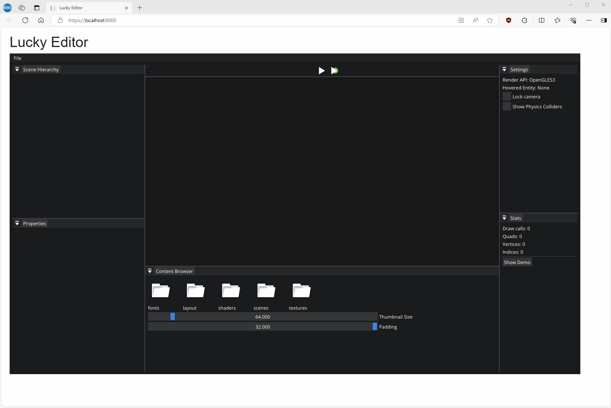

## Lucky Engine ##

A basic 2D/3D engine framework (OpenGL) working with Visual Studio and EMCC (web assembly) compilers.

The project is configured to build inside [Visual Sudio](https://visualstudio.microsoft.com/fr/downloads/).

The solution and projects are generated with **Premake5** (binary is included in repository in `Vendors/Binary/Premake` folder).
<span style="color:orange">Remarks:</span> The provided Premake binary is a modified version adding some new features. The source code is available [here](https://github.com/alexandrelugand/premake-core).

A section with all necessary Visual Studio extensions is described below.



# Setup

## Visual Studio
- Install Visual Studio and select features under:
	- Web development and ASP.Net (with .Net WebAssembly Build Tools for .Net 8.0)
	- .Net Desktop development
	- C++ Desktop development
- Download [SWIGWIN](https://sourceforge.net/projects/swig/files/swigwin/swigwin-4.2.1/swigwin-4.2.1.zip/download) and unzip it in folder `C:\swigwin-4.2.1`
- Add `SWIGWIN` environment variable with value = `C:\swigwin-4.2.1`

## Python
- Install (Python 3)[https://www.python.org/downloads]
- Add `PYTHON` environment variable with installation path of Python
- Install `etree` package with command `pip install elementpath`
- Install `lxml` package with command `pip install lxml`

## Web Assembly
- Install [EMSDK](https://emscripten.org/docs/getting_started/downloads.html) by following installation procedure (default folder at `C:\emsdk`)
- Add `EMSDK` environment variable with value = `C:\emsdk`
- Add `Emscripten` environment variable with value = `C:\emsdk\upstream\emscripten`
- You can alos add `C:\emsdk` and `C:\emsdk\upstream\emscripten` in PATH environment variable
- Install 3.1.34 specific version (same as dotnet using) with command `emsdk install 3.1.34`
- Check if EMCC compiler works fine in cmd console with command:
    ```
    emsdk_env
    ```
    It must return something like this
    ```
    Setting up EMSDK environment (suppress these messages with EMSDK_QUIET=1)
    Setting environment variables: ...
    ```
    After checks if EMCC compiler is correctly configured by typing this command
    ```
    emcc -v
    ```
    It must return something like this
    ```
    emcc (Emscripten gcc/clang-like replacement + linker emulating GNU ld) 3.1.34 (57b21b8fdcbe3ebb523178b79465254668eab408) ...
    ```

## Visual Studio extensions

- [Emscripten Build Target](https://marketplace.visualstudio.com/items?itemName=KamenokoSoft.emscripten-build-support)
- [Open Command Line](https://marketplace.visualstudio.com/items?itemName=MadsKristensen.OpenCommandLine64)

## Chrome / Edge extensions
- [C/C++ DevTools Support (DWARF)](https://chromewebstore.google.com/detail/cc++-devtools-support-dwa/pdcpmagijalfljmkmjngeonclgbbannb)

## Solution / projects generation

To generate solution and projects, launch the `setup.cmd` script.
It will launch Premake5 binary and will produce solution and projects.
In Visual Studio, the `setup.cmd` script can be launch using the `Open Command Line` extension with contextual menu `Execute file`. 

# Assets

**Assets** are stored in `LuckyEditor` project in `assets` folder.
The `resources` folder contains all mandatory files for Lucky Editor execution (images, scripts).

This folders are available in **Blazor Lucky Editor** project by using symbolic links.
To create them, launch `symlinks.cmd` script (with administrator rights).
<span style="color:orange">Remarks:</span> Window user must have the permission to create symbolic link. To enable it, please refer to this [article](https://experienceleague.adobe.com/en/docs/experience-manager-learn/ams/dispatcher/git-symlinks).

# Troubleshooting

## Blazor Lucky Editor

During execution of Blazor Lucky Editor, if filesystem.txt file (include in `wwwroot`) is not up to date with folders and files to download,
it can generate some erros, then be careful to update the file with the correct file system structure.
