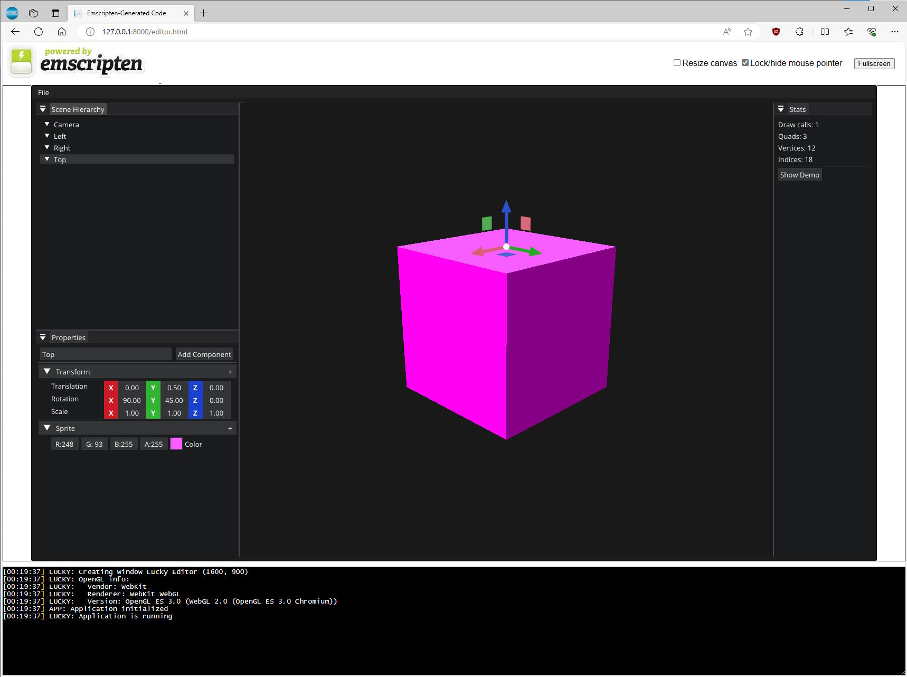

## Lucky Engine ##

A basic 3D engine framework (OpenGL) working with GCC (native) and EMCC (web assembly) compilers.

The project is configured to build inside [VS Code](https://code.visualstudio.com/download).
The native Makefiles are generated with Premake5 (binary is included in repository in `Vendors/Binary/Premake` folder).

A section with all necessary VS code extensions is described below.



# Setup

## Native

- Install [MSYS2](https://www.msys2.org/docs/installer/) in default folder at `C:\msys64`
- Launch MSYS2 MSYS console and enter this command:
    ```
    pacman -S mingw-w64-ucrt-x86_64-toolchain   
    ```
    Install all packages (press Enter) annd accept all packages with 'Y'
- Add `C:\msys64\ucrt64\bin` in PATH environment variable
- Check if GCC or G++ compiler works fine in cmd console with command:
    ```
    gcc -v
    ```
    It must return something like this

    ```
    gcc version 13.2.0 (GCC)
    ```
- Install [Make (GNU)](https://sourceforge.net/projects/getgnuwin32/) in default folder at `C:\GnuWin32`
- Add `C:\GnuWin32\bin` in PATH environment variable
- Check if make works fine in cmd console with command:
    ```
    make -v
    ```
    It must return something like this

    ```
    GNU Make 4.4.1
    ```

## Web Assembly

- Install [EMSDK](https://emscripten.org/docs/getting_started/downloads.html) by following installation procedure (default folder at `C:\emsdk`)
- Add `Emsdk` environment variable with value = `C:\emsdk`
- Add `Emscripten` environment variable with value = `C:\emsdk\upstream\emscripten`
- You can alos add `C:\emsdk` and `C:\emsdk\upstream\emscripten` in PATH environment variable
- Check if EMCC compiler works fine in cmd console with command:
    ```
    emsdk_env
    ```
    It must return something like this
    ```
    Setting up EMSDK environment (suppress these messages with EMSDK_QUIET=1)
    Setting environment variables: ...
    ```
    After checks if EMCC compiler is correctly configured by typing this command
    ```
    emcc -v
    ```
    It must return something like this
    ```
    emcc (Emscripten gcc/clang-like replacement + linker emulating GNU ld) 3.1.47 (431685f05c67f0424c11473cc16798b9587bb536) ...
    ```
 - Install [NodeJS (LTS version)](https://nodejs.org/en/download)
 - Install [local-web-server](https://www.npmjs.com/package/local-web-server) with NPM by typing command below:
    ```
    npm i -g local-web-server
    ```
- Check if local-web-server works fine in cmd console with command:
    ```
    ws -s
    ```
    It must return something like this
    ```
    Listening on http://MACHINE_NAME:8000, http://IP_ADDRESS:8000, http://127.0.0.1:8000
    ```
    Press Ctrl+C to stop local web server

## VS Code extension

- [C/C++](https://marketplace.visualstudio.com/items?itemName=ms-vscode.cpptools)
- [C/C++ Extention Pack](https://marketplace.visualstudio.com/items?itemName=ms-vscode.cpptools-extension-pack)
- [C/C++ Themes](https://marketplace.visualstudio.com/items?itemName=ms-vscode.cpptools-themes)
- [Make support and task provider](https://marketplace.visualstudio.com/items?itemName=carlos-algms.make-task-provider)
- [Premake snippets](https://marketplace.visualstudio.com/items?itemName=holychicken99.premake-snippets)
- [Task Runner](https://marketplace.visualstudio.com/items?itemName=forbeslindesay.forbeslindesay-taskrunner)
- [Visual Studio Keymap](https://marketplace.visualstudio.com/items?itemName=ms-vscode.vs-keybindings)
- [VSCode icons](https://marketplace.visualstudio.com/items?itemName=vscode-icons-team.vscode-icons)
- [WebAssembly DWARF Debugging](https://marketplace.visualstudio.com/items?itemName=ms-vscode.wasm-dwarf-debugging)

## Chrome / Edge extensions
- [C/C++ DevTools Support (DWARF)](https://chromewebstore.google.com/detail/cc++-devtools-support-dwa/pdcpmagijalfljmkmjngeonclgbbannb)

## Makefile generation

To generate Makefile for G++, please launch `Setup` task in **Run and Debug** VS code tab. It will launch Premake5 binary and will produce GNU Makefile (with **gmake2** module).

For Web assembly, the Makefile is already generated (`Makefile.wasm.mk`).

# Compile and launch

## Native

In **Run and Debug** VS code tab, select `Debug` or `Release` tasks to compile and launch in Debug or Release mode.

If you want to speed up recompilation, you can use `ccache` utility. It can be download [here](https://ccache.dev/).
Install `ccache` in same folder as g++ (by default: `C:\msys64\ucrt64\bin`).

In **premake5.lua** files, comment (desactivate) or uncomment (activate) section `makesettings [[CXX = ccache g++]]` to override default compiler with ccache.

## Web Assembly

In **Run and Debug** VS code tab, select `Wasm` task to compile and launch wasm binaries (wasm + js + app.html). At the end of compilation, VS code will open default browser to the URL http://127.0.0.1:8000.
